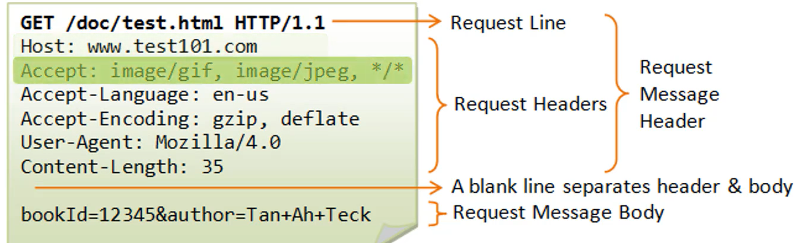

## Request e Response

💭 Imagine que você está acessando um site e para isso utiliza um browser para definir o endereço e visualizar as páginas.

Por baixo dos panos, o browser faz uma operação de request, via HTTP, até a internet, chegando ao servidor que a página está hospedada. Por sua vez, o servidor devolve a resposta.

No caso do REST, a requisição é feita pelo client. Pode ser um client que utiliza smartphone, tablet, desktop etc. 

#### Request

Em uma representação de uma Request nós temos a linha da request, o cabeçalho com as informações do host. os MIME Types, o idioma, o user agente, dentre outros atributos. 

A Request line e o cabeçalho da request formam o cabeçalho da mensagem de request. 

Em seguida, temos uma linha que separa o header do body e o body contém os parâmetros.

#### Response

A Response é a devolução do resultado do processamento da request que foi enviada.

* Primeiro, localizasse a linha de status com o status cold podendo ser 200 ok ou [algum outro](https://httpstatusdogs.com/) stts.
* Logo abaixo, encontra-se o cabeçalho da Response, com as informações como 'data' e o servidor que processou a solicitação, data da última modificação, Content type, como HTML e um body, que pode ser um HTML.

