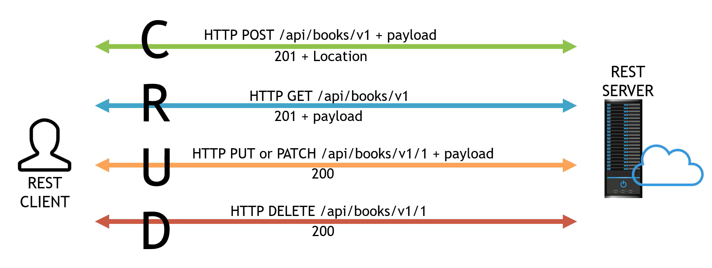

## Status Code
Forma como o servidor/ API responde aos clients sobre o que ocorreu durante o processamento de uma request.

**Existem 5 grupos de Status Code, são eles:**
- 100 a 102 Informacionais;
- 200 a 226 Sucesso;
- 300 a 308 Redirecionamento
- 400 a 499 Erros de client;
- 500 a 599 Erro de servidor.

**✨ Links Úteis:**

**Oracle:** https://docs.oracle.com/en/cloud/paas/integration-cloud/rest-api/StatusCodes.html

**Rest API tutorial:** https://www.restapitutorial.com/httpstatuscodes.html

**DZone:** https://dzone.com/refcardz/rest-foundations-restful?chapter=5

**Semeru:** http://www.semeru.com.br/blog/http-status-codes-em-servicos-rest/

### Verbos HTTP e o REST

* **Criar novo recurso:** HTTP POST
* **Buscar ou Ler:** HTTP GET
* **Atualizar:** HTTP PUT or PATCH
* **Deletar:** HTTP DELETE

#### GET: Utilizado para selecionar/ Recuperar um recurso.

- O verbo HTTP GET é comumente utilizado para ler ou recuperar uma representação de um recurso. Em um "cenário feliz", uma requisição GET retorna uma representação em XML ou JSON em um HTTP Status Code 200 (OK). Em um cenário de erro o retorno mais comum é 404 (NOT FOUND) ou 400 (BAD REQUEST).

**Parâmetros suportados:** 

- Via URL (PATH ou QUERY PARAMS)
- Via HEADER

#### POST: Utilizado para criar/ Inserir recurso

- Verbo HTTP POST é mais frequentemente usado para criar novos recursos - inserir um novo item na base.
- Em uma aplicação REST perfeita quando uma operação é executada com sucesso, retorna-se o status code 200 ou 201.

**Parâmetros suportados:**
- Via URL (PATH ou QUERY PARAMS);
- Via HEADER;
- Via Body.

#### PUT: utilizado para fazer UPDATE/ para mofificar um recurso

- O verbo PUT é comumente usado para atualizar informações, colocando um recurso conhecido no (body) corpo da requisição contendo novas informações que representam o recurso original;
- Um update bem sucedido, retorna um **status code** 200 (ou 204 quando não retorna nenhum conteúdo no body).

**Parâmetros suportados:**

- Via URL (PATH ou QUERY PARAMS);
- Via HEADER;
- Via Body. (use-o como preferência)

#### DELETE: utilizado para remover um recurso

- O verbo DELETE é simples de compreender, ele é usado para deletar um recurso identificado por uma URI;
- Em uma deleção bem sucedida retorna-se um **status code 200 (OK)** juntamente com um response body, pssivelmente uma representação do item deletado (o que acaba por demandar muita banda), ou uma response customizada;
- Caso considere relevante, pode retornar um **Status Code 204 (NO CONTENT)** **sem** response body ou um **status code 204** **sem** corpo, ou [JSEND-style](https://github.com/omniti-labs/jsend#:~:text=BSD%2D3%2DCl%C3%A1usula-,JEnviar,-O%20que%3F) response com um status code 200 são as responses mais recomendadas.

**Parâmetros suportados:**
- Via URL (PATH ou QUERY PARAMS)
- Via HEADER;
- Via Body.