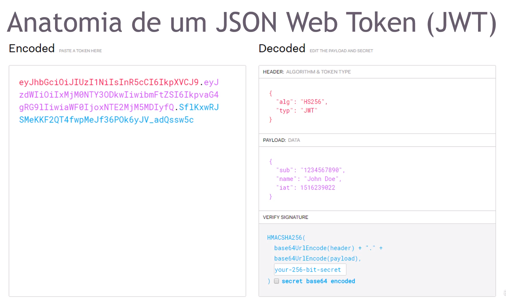

## Como um Token de Autenticação Funciona?

**JWT Codificado:**

- **Encoded:** Esta é a representação codificada de um JWT. Ele é composto por três partes, separadas por pontos("."):
    - **Header (Cabeçalho):** Codificado em Base64URL.
    - **Payload (Carga útil):** Também codificada em Base64URL.
    - **Signature (Assinatura):** Resultado da assinatura do cabeçalho e do payload, codificado em Base64URL. 

**JWT Decodificado:**

- Decoded: Este lado mostra as partes decoficdas do JWT.
    - HEADER: Mostra o algoritmo ('HS256' para HMAC SHA-256) e o tipo de token ('JWT').
    - PAYLOAD: Contém as afirmações (claims) como:
        - 'SUb' (subject) Identidade do usuário, neste caso, "1234567890".
        - 'name' Nome do usuário, neste caso, "John Doe".
        - 'iat' (issued at): Timestamp de quandoo token foi emitido.
    - VERIFY SIGNATURE:Descreve como a assinatura é verificada. Usando o cabeçalho e o payload codificados em Base65URL, juntamente com o segredo, você aplica o algoritmo de assinatura para verificar se o token é válido.

#### Como o JWT funciona no REST?

JTW é comumente usado em APIs REST para autenticação e autorização. Aqui está um resumo simplificado de como ele funciona em um cenário de API REST:
- Login: O usuário se autentica na aplicação (por exemplo, com nome de usuário e senha).
- Token de Acesso: Após a autenticação bem-sucedida, o servidor gera um JWT que contém o identificador do usuário (e outras informações necessárias) e uma assinatura digital.
- Envio do Token: O servdor envia o JWT de volta ao client.
- Uso do Token: O cliente envia o JWT em requisições subsequentes, geralmente no cabeçalho 'Authorization', para acessar rotas protegidas.
- Verificação do Token: O servidor verifica a assinatura do JWT com o segredo ou chave pública. Se a assinatura for válida e o token não estiver expirado, o servidor aceitará a requisição.
- Resposta do Servidor: O servidor processa a requisição e retorna a resposta apropriada ao client.

A vantagem do JWT em APIs REST é que ele permite uma autenticação stateless. O servidor não precisa manter o estado da sessão; ele pode verificar quem está fazendo a requisição simplesmente verificando a assinatura do token enviado pelo cliente. Isso torna o JWT uma escolha popular para autenticação em serviços escaláveis e distribuídos.

