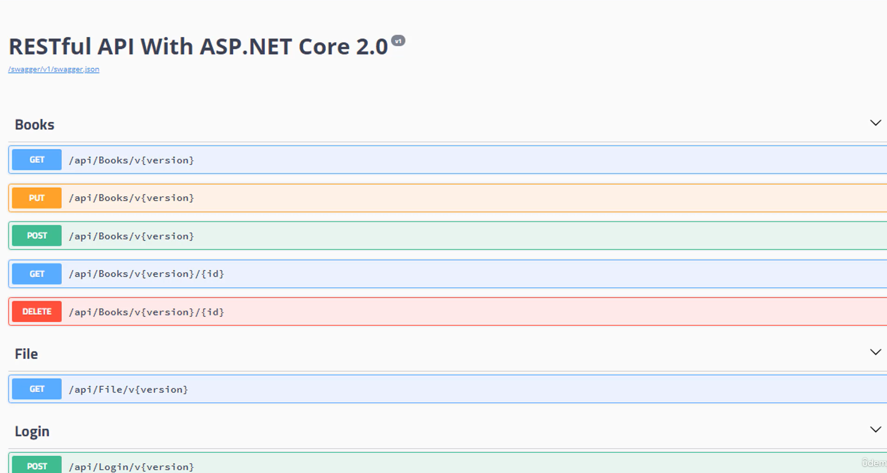

## Documentação com SWAGGER

Swagger é um framework que serve para documentar APIs REST. Ele facilita para que os desenvolvedores dos clients que irão consumir as nossas APIs saibam quais os parâmetros nossas operações suportam, qual o retorno, o modelo Type retornado, JSON, XML, CSV.

Dessa forma, os desenvolvedores das aplicações clients não precisam necessariamente discutir com a equipe de desenvolvimento da API para saber como usá-la.

Pode-se dizer que, a grosso modo, o Swagger se comporta de modo similar ao velho WS SDL das aplicações.

**Exemplo:**

Como podemos ver acima, o Swagger documenta cada um dos recursos, e os separa por verbo.